# 🌡️ WBGT-Alert-System
### Automated Heat Stress Monitoring & Alert System for Industrial Safety

[](https://www.microsoft.com/en-us/microsoft-365/forms)
[](https://flow.microsoft.com/)
[](https://telegram.org/)

## 📋 Overview
WBGT-Alert-System is an automated temperature monitoring solution that ensures worker safety through real-time heat stress monitoring. The system integrates Microsoft Forms for data collection, Power Automate for intelligent processing, and Telegram for instant alerts.

## 🏗️ System Architecture

```mermaid
---
config:
  layout: fixed
---
flowchart LR
 subgraph Input["Data Input"]
        B["Form Trigger"]
        A["Microsoft Form"]
  end
 subgraph Process["Power Automate"]
        C["Temperature Check"]
        D["Condition Logic"]
        E["Message Format"]
  end
 subgraph Output["Alert"]
        F["Telegram Bot"]
        G["Channel"]
  end
    A -- Form Response --> B
    B -- Get Details --> C
    C -- Evaluate --> D
    D -- Generate --> E
    E -- Send --> F
    F -- Notify --> G
     B:::input
     A:::input
     C:::process
     D:::process
     E:::process
     F:::output
     G:::output
    classDef input fill:#e6f3ff,stroke:#3399ff,stroke-width:2px
    classDef process fill:#fff2e6,stroke:#ff9933,stroke-width:2px
    classDef output fill:#ffe6e6,stroke:#ff3333,stroke-width:2px
```



## 🌟 Key Features
- 🌡️ Real-time WBGT monitoring and alerts
- 🚨 Three-tier temperature classification
- 📱 Instant Telegram notifications
- 🔄 Automated safety guidelines
- 📝 Digital documentation
- ⚡ Quick response system

## 💡 Alert Levels and Actions

| Level | Temperature | Alert | Guidelines |
|-------|------------|--------|---------|
| HIGH | ≥33°C | ☀️☀️ | - Minimize outdoor activities<br>- 15-minute breaks hourly<br>- Mandatory hydration |
| MODERATE | ≥31°C | 🌤️ | - Reduce outdoor activities<br>- 10-minute breaks hourly<br>- Regular hydration |
| LOW | <31°C | 🌥️ | - Normal activities<br>- Regular breaks<br>- Standard hydration |

## 🛠️ Technology Stack
- **Data Collection**: Microsoft Forms
- **Automation**: Power Automate
- **Alerts**: Telegram Bot API
- **Documentation**: Markdown

# 📁 WBGT-Alert-System Project Structure

```
WBGT-Alert-System/
├── docs/
│   ├── maintenance-guide.md
│   ├── user-guidelines.md
│   ├── additional-features.md
│   └── backup-plan.md
├── flows/
│   ├── production/
│   │   └── wbgt-alert-flow.json
│   └── backup/
│       └── wbgt-alert-backup.json
├── google/
│   ├── form/
│   │   └── form-template.json
│   └── src/
│       └── script.gs
├── forms/
│   └── wbgt-form-template.json
├── images/
│   ├── flow-screenshots/
│   └── form-screenshots/
├── templates/
│   └── message-templates.md
├── CONTRIBUTING.md
├── LICENSE
└── README.md
```

## 🚀 Setup Guide

### 1. Microsoft Form Setup
1. Create new form
2. Add required fields:
   - Weather Condition (Choice)
   - Time (Choice)
   - WBGT Reading (Number)
   - Tested By (Text)
3. Set validation rules

### 2. Power Automate Configuration
1. Create automated flow
2. Add Microsoft Forms trigger
3. Configure temperature conditions
4. Set up message templates
5. Add Telegram connection

### 3. Telegram Integration
1. Create bot via BotFather
2. Set up channel
3. Add bot to channel
4. Configure permissions

## 📊 System Flow
1. Safety officer submits WBGT reading via Microsoft Form
2. Power Automate processes the submission
3. System evaluates temperature level
4. Appropriate guidelines are selected
5. Alert is formatted and sent
6. Channel members receive notification

## 📚 Documentation
Comprehensive guides available in docs folder:
- System Maintenance Guide
- User Guidelines
- Additional Features
- Backup Plans

## 🔐 Security Features
- Private channel communication
- Authenticated form access
- Secure bot token
- Validated data processing

## 🤝 Contributing
Contributions welcome! Please read our contributing guidelines before submitting pull requests.

## 📄 License
This project is licensed under the MIT License - see the LICENSE file for details.

## 📧 Connect with Me

- 📧 Email: toriqul.int@gmail.com
- 📱 Phone: +65 8936 7705, +8801765 939006
- 🌐 LinkedIn: [@TheToriqul](https://www.linkedin.com/in/thetoriqul/)
- 🐙 GitHub: [@TheToriqul](https://github.com/TheToriqul)
- 🌍 Portfolio: [TheToriqul.com](https://thetoriqul.com)

---
Developed with ❤️ by TheToriqul for industrial safety